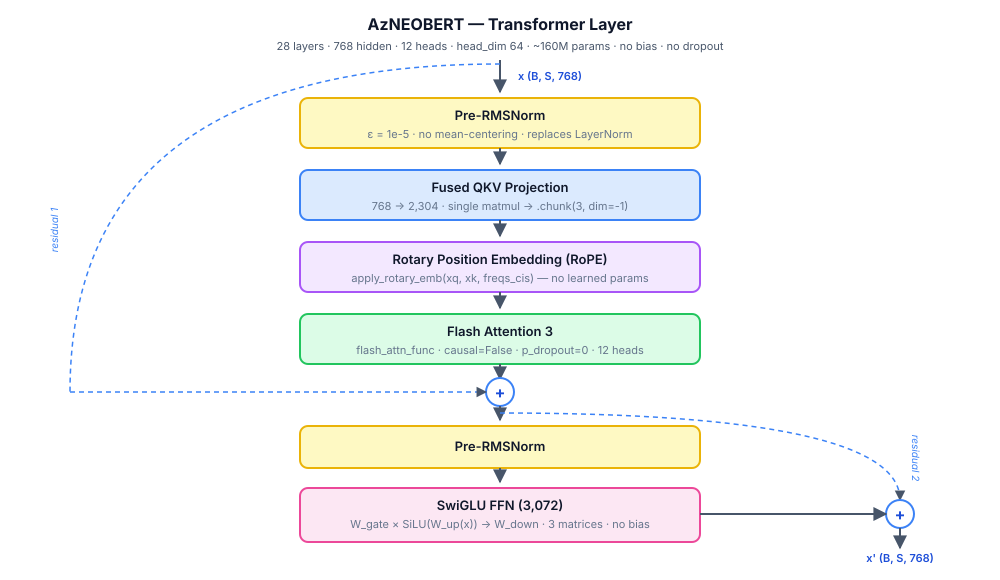
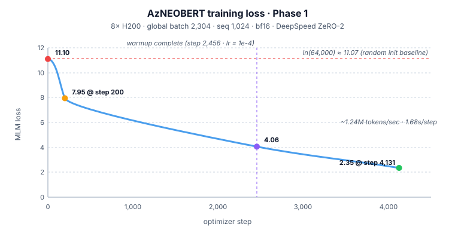

*Status: **In training** · Phase 1 active on 8× NVIDIA H200 · Component 2 of the AzBERT pipeline*

## TL;DR

I am training AzNEOBERT — an Azerbaijani encoder language model from scratch, based on the NeoBERT architecture. The model runs on 8× NVIDIA H200 GPUs via SLURM, trained on ~12.2B tokens of Azerbaijani text across 11 corpus collections. Infrastructure stack: DeepSpeed ZeRO-2, Flash Attention 3, and `torch.compile`, reaching 1.24M tokens/sec throughput. Loss dropped from 11.1 (random init) to 2.35 within the first 4,100 steps.

This is the second component of the AzBERT pipeline — built directly on top of the [Azerbaijani tokenizer](/projects/az-tokenizer/).

---

## Problem — Why Train from Scratch

No dedicated Azerbaijani encoder model exists with modern architecture. The practical options are multilingual models (mBERT, XLM-R) or community BERT variants trained on limited data with outdated architectures.

The cost of relying on multilingual models is documented: mBERT tokenizes Azerbaijani at 3.7 fertility — nearly 4 subword pieces per word on average. This wastes sequence length and degrades attention locality on an agglutinative language where a single word often carries clause-level meaning. Beyond tokenization, multilingual models share capacity across 100+ languages, leaving Azerbaijani morphology and syntax under-represented at every layer.

Training from scratch with a language-specific tokenizer (64k vocab, 1.67 fertility) and a modern encoder architecture is the only path to a model that understands Azerbaijani natively.

---

## Architecture



AzNEOBERT follows the NeoBERT design — a modernized BERT replacing every outdated component with its current best-practice equivalent.

| Parameter | Value |
|---|---|
| Hidden size | 768 |
| Layers | 28 |
| Attention heads | 12 |
| Head dimension | 64 |
| FFN intermediate | 3,072 |
| Max sequence length | 1,024 (Phase 1) |
| Positional encoding | RoPE |
| Normalization | Pre-RMSNorm (ε = 1e-5) |
| Activation | SwiGLU |
| Bias | None |
| Dropout | None |
| Parameters | ~160M |

### What changed vs. original BERT

**RoPE instead of learned absolute positions.** Rotary Position Embeddings encode relative position directly into the attention computation, generalizing better to sequence lengths unseen during training. This matters for Phase 2, where the sequence length extends to 4,096.

**Pre-RMSNorm instead of Post-LayerNorm.** Normalizing before each sub-layer (rather than after) stabilizes training at scale — gradient magnitude stays bounded without requiring careful initialization. RMSNorm drops the mean-centering term from LayerNorm, reducing compute with no quality loss.

**SwiGLU instead of GELU FFN.** The gated linear unit variant replaces the two-matrix FFN with a three-matrix gated structure, consistently outperforming GELU on language modeling benchmarks at matched parameter count.

**No bias, no dropout.** Both are removed following modern large-model practice. Bias terms add parameters without expressivity; dropout at pretraining scale degrades rather than regularizes.

### Attention implementation

```python
# Fused QKV projection + RoPE + Flash Attention 3
projection = self.qkv(x)                           # single fused projection
xq, xk, xv = projection.chunk(3, dim=-1)
xq, xk = apply_rotary_emb(xq, xk, freqs_cis)      # LLaMA-style RoPE
out = flash_attn_func(xq, xk, xv, dropout_p=0.0)  # Flash Attention 3
```

---

## Dataset

| Collection | Documents | Source Type |
|---|---|---|
| hplt3 | 2,000,000 | Filtered web crawl |
| fineweb2 | 1,500,000 | Curated web |
| court_cases | 1,500,000 | Legal text |
| cc100 | 1,300,000 | Web crawl |
| culturax | 1,200,000 | mC4 + OSCAR |
| pdfs | 1,200,000 | PDF extractions |
| nllb | 1,000,000 | Sentence-level parallel |
| news | 1,100,000 | News articles |
| e-qanun | 531,000 | Legislative text |
| folklor | 338,000 | Dialectal / folkloric |
| wikipedia | — | Encyclopedic |

**Total: ~11.9M sequences × 1,024 tokens = ~12.2B tokens**

Data is stored as memory-mapped numpy arrays (`int32` token IDs + `int64` offsets per collection) and loaded with `mmap_mode='r'` — the full dataset never enters RAM. A flat shuffle across all 11 collections feeds a cycling iterator; the dataset repeats ~25 times over 127,000 training steps, equivalent to ~300B token passes.

---

## Training Recipe

### Phase 1

| Hyperparameter | Value |
|---|---|
| Sequence length | 1,024 |
| Global batch size | 2,304 |
| Per-device batch size | 48 |
| Gradient accumulation | 6 steps |
| Total steps | 127,000 (~300B tokens) |
| Warmup | 2,000 steps |
| Peak learning rate | 1e-4 |
| LR schedule | Linear warmup → cosine decay to 0 |
| AdamW β₁, β₂ | 0.9, 0.95 |
| Weight decay | 0.01 |
| Gradient clipping | 1.0 |
| Mixed precision | bf16 |
| MLM mask rate | 20%, 100% masked with `[MASK]` |

Weight decay is applied only to weight matrices (ndim ≥ 2); norm weights and bias-equivalent vectors are excluded.

### Phase 2 (pending)

Sequence length extends to 4,096 with a reduced global batch size of 512 for 7,000 additional steps. RoPE handles the context extension without positional extrapolation issues.

---

## Infrastructure

**Cluster:** Single node, 8× NVIDIA H200 (141 GB VRAM each) — 1.1 TB total GPU memory  
**Scheduler:** SLURM with Apptainer containers  
**Distributed:** HuggingFace Accelerate + DeepSpeed ZeRO-2

### Optimizations

| Optimization | Effect |
|---|---|
| `torch.compile` | ~37% faster per step |
| DeepSpeed ZeRO-2 | ~10% faster, partitions optimizer state across GPUs |
| Flash Attention 3 | ~4% faster at seq_len=1024; major gains expected at 4096 |
| `PYTORCH_CUDA_ALLOC_CONF=expandable_segments:True` | Reduces memory fragmentation on H200 |
| TF32 enabled | Marginal gain at bf16-dominant workload |
| `persistent_workers=True` | Eliminates dataloader respawn overhead |

**Throughput: ~1.24M tokens/sec across 8× H200**  
**Step time: ~1.68 seconds per optimizer step**  
**Estimated Phase 1 duration: ~60 hours**

The `torch.compile` gain of 37% is notable given the RoPE complex operation warning — the compiler still optimizes effectively despite the warning, which reflects a graph break rather than a correctness issue.

---

## Loss Curve



| Step | Loss | Note |
|---|---|---|
| 0 | 11.10 | Random init — ln(64,000) |
| 200 | 7.95 | Early rapid descent |
| 2,456 | 4.06 | Warmup complete, lr = 1e-4 |
| 4,131 | 2.35 | Stable training phase |

The initial loss of 11.1 matches the theoretical random prediction baseline for a 64k-token vocabulary (`ln(64000) ≈ 11.07`). The drop to 2.35 by step 4,131 — within the first 3% of training — confirms the architecture and data pipeline are functioning correctly.

---

## Status

**Phase 1: in training.** A checkpoint compatibility issue between non-DeepSpeed and ZeRO-2 checkpoint formats requires resolution before resuming from the latest saved state.

**Phase 2: pending.** Sequence length extension to 4,096 after Phase 1 completes.

---

## Stack

`Python` · `PyTorch` · `DeepSpeed ZeRO-2` · `HuggingFace Accelerate` · `Flash Attention 3` · `torch.compile` · `SLURM` · `Apptainer` · `wandb` · `numpy mmap`

---

*Component 2 of the AzBERT pretraining pipeline. Built on the [Azerbaijani tokenizer](/projects/az-tokenizer/).*
