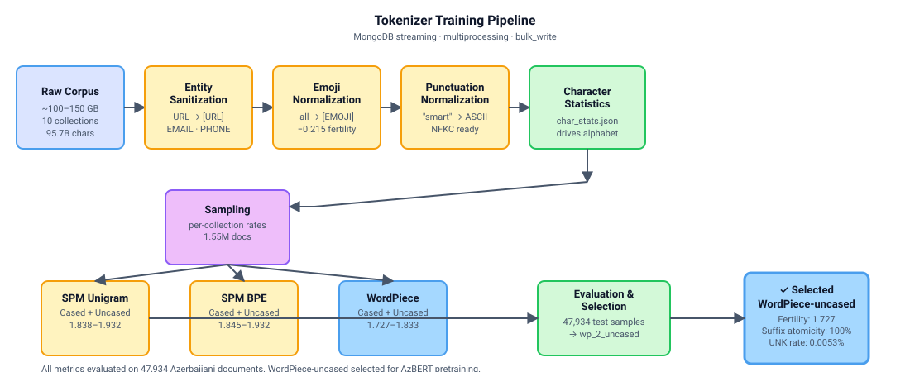
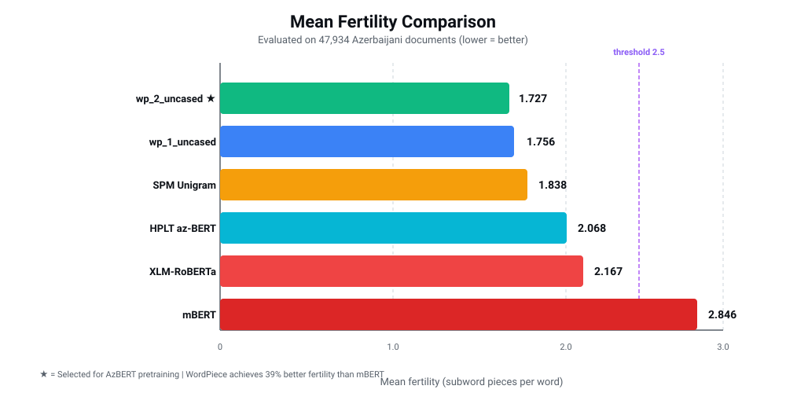

<style>
  .modal {
    display: none;
    position: fixed;
    z-index: 1000;
    left: 0;
    top: 0;
    width: 100%;
    height: 100%;
    overflow: auto;
    background-color: #ffffff;
  }
  
  .modal.light-mode {
    background-color: #ffffff;
  }
  
  @media (prefers-color-scheme: dark) {
    .modal.dark-mode {
      background-color: #1a1a1a;
    }
  }
  
  .modal-content {
    margin: auto;
    padding: 40px 20px;
    max-width: 90vw;
    max-height: 90vh;
    overflow: auto;
    display: flex;
    align-items: center;
    justify-content: center;
  }
  
  .modal-content img {
    max-width: 100%;
    max-height: 85vh;
    height: auto;
  }
  
  .modal-close {
    position: absolute;
    top: 20px;
    right: 30px;
    font-size: 28px;
    font-weight: bold;
    cursor: pointer;
    color: #666;
  }
  
  @media (prefers-color-scheme: dark) {
    .modal-close {
      color: #999;
    }
  }
  
  .modal-close:hover {
    color: #000;
  }
  
  @media (prefers-color-scheme: dark) {
    .modal-close:hover {
      color: #fff;
    }
  }
  
  img.clickable {
    cursor: zoom-in;
  }
</style>

<script>
  function setupModals() {
    const modals = document.querySelectorAll('.modal');
    
    // Close all modals
    function closeAllModals() {
      modals.forEach(modal => {
        modal.style.display = 'none';
      });
      document.body.style.overflow = 'auto';
    }
    
    // Set up each image-modal pair
    document.getElementById('pipeline-img').addEventListener('click', (e) => {
      e.stopPropagation();
      closeAllModals();
      const modal = document.getElementById('pipeline-modal');
      modal.style.display = 'block';
      document.body.style.overflow = 'hidden';
      applyTheme(modal);
    });
    
    document.getElementById('fertility-img').addEventListener('click', (e) => {
      e.stopPropagation();
      closeAllModals();
      const modal = document.getElementById('fertility-modal');
      modal.style.display = 'block';
      document.body.style.overflow = 'hidden';
      applyTheme(modal);
    });
    
    // Set up close buttons and overlay clicks
    modals.forEach(modal => {
      const closeBtn = modal.querySelector('.modal-close');
      const content = modal.querySelector('.modal-content');
      
      closeBtn.addEventListener('click', (e) => {
        e.stopPropagation();
        modal.style.display = 'none';
        document.body.style.overflow = 'auto';
      });
      
      // Close on background click, but not on image click
      modal.addEventListener('click', (e) => {
        if (e.target === modal) {
          modal.style.display = 'none';
          document.body.style.overflow = 'auto';
        }
      });
      
      // Prevent closing when clicking on the image
      content.addEventListener('click', (e) => {
        e.stopPropagation();
      });
    });
  }
  
  function applyTheme(modal) {
    if (window.matchMedia && window.matchMedia('(prefers-color-scheme: dark)').matches) {
      modal.classList.add('dark-mode');
      modal.classList.remove('light-mode');
    } else {
      modal.classList.add('light-mode');
      modal.classList.remove('dark-mode');
    }
  }
  
  // Initialize when DOM is ready
  document.addEventListener('DOMContentLoaded', setupModals);
</script>

*Status: **Complete** · WordPiece-uncased (1.727 fertility) selected for AzBERT pretraining · Component 1 of the AzBERT pipeline*

## TL;DR

I trained and compared three tokenizer algorithms — SentencePiece Unigram, SentencePiece BPE, and WordPiece — each in cased and uncased variants (6 total), on a preprocessed 100 GB Azerbaijani corpus. WordPiece-uncased was selected for AzBERT pretraining with fertility **1.727**, UNK rate 0.0053%, and 4.572 characters per token — outperforming all SPM variants and mBERT (fertility 2.846). All three algorithms were evaluated rigorously on 47,934 test samples.

The entire preprocessing and training pipeline processes ~100 GB of raw text via MongoDB streaming cursors and multiprocessing — no data ever fits in memory.

---

## Problem

Azerbaijani is a morphologically rich agglutinative language with ~10 million speakers and almost no dedicated NLP infrastructure. Every Azerbaijani NLP application in production — including [e-qanun.ai](https://e-qanun.ai), which I also built — relies on multilingual tokenizers like mBERT or XLM-R that were never designed for Azerbaijani.

The cost of this is measurable. mBERT fragments the average Azerbaijani word into 3.7 subword tokens. A word like *müqavilələrindən* (from their contracts) becomes six pieces. This fragmentation wastes token budget, degrades attention locality, and limits downstream task performance on a language that packs dense semantic content per word.

The fix requires training a tokenizer on a large, clean, representative Azerbaijani corpus — which first requires building that corpus.

---

## Corpus

| Collection | Documents | Size | Source Type |
|---|---|---|---|
| hplt3_final | 11,000,000 | 32.3 GB | Filtered web crawl |
| fineweb2_final | 7,200,000 | 21.2 GB | Curated web |
| nllb_final | 96,000,000 | — | Sentence-level parallel |
| culturax_final | 5,000,000 | 13.0 GB | mC4 + OSCAR |
| cc100_final | 3,900,000 | 5.5 GB | Web crawl |
| news_v1 | 3,200,000 | 7.9 GB | News articles |
| court_cases | 1,900,000 | 1.3 GB | Legal text |
| pdfs_part1 | 1,600,000 | 1.2 GB | PDF extractions |
| e-qanun | 531,000 | 466 MB | Legislative text (100% included) |
| folklor | 338,000 | — | Folkloric / dialectal (100% included) |

**Total raw corpus: ~100–150 GB, ~95.7 billion characters** (measured post-normalization steps 1–3).

The `folklor` and `e-qanun` collections are included in full — folkloric text provides irreplaceable dialectal coverage, and legislative text is a high-signal, near-zero-noise domain. For the larger web crawl sources, sampling rates are set by per-collection character analysis: contamination rates, Cyrillic ratios, UTF-8 mojibake presence, and replacement character frequency.

**Tokenizer training sample: 1,550,000 documents** drawn across all 10 collections after evaluation holdout separation.

---

## Preprocessing Pipeline



<div id="pipeline-modal" class="modal">
  <span class="modal-close">&times;</span>
  <div class="modal-content">
    
  </div>
</div>

All scripts follow the same architecture: MongoDB streaming cursor → multiprocessing pool → batch `bulk_write`. No collection is ever loaded into memory.

### Step 1 — Entity Sanitization

Regex-based detection replaces structured entities with placeholder tokens that the tokenizer will learn as atomic units:

| Entity | Placeholder |
|---|---|
| URLs | `[URL]` |
| Email addresses | `[EMAIL]` |
| Phone numbers | `[PHONE]` |

```
Input:  "Visit https://example.com or call +994501234567"
Output: "Visit [URL] or call [PHONE]"
```

### Step 2 — Emoji Normalization

All emoji replaced with `[EMOJI]`. Precompiled regex covering all major Unicode emoji ranges. This step's effect on tokenizer quality is isolated in Experiment 2: emoji removal alone reduces mean fertility by 0.215 points.

### Step 3 — Punctuation Normalization

Visually similar punctuation canonicalized to ASCII equivalents using a translation table:

| Source | Canonical |
|---|---|
| `"` `"` `„` | `"` (U+0022) |
| `'` `'` | `'` (U+0027) |
| `—` `–` `−` | `-` (U+002D) |
| `…` | `...` |
| NBSP / thin space / zero-width space | regular space |

### Step 4 — Character Statistics

Corpus-wide character frequency analysis across all collections, streaming per-document into a shared `Counter`. Output (`char_stats.json`) drives all subsequent alphabet decisions — rare character thresholds, Cyrillic contamination rates, and vocabulary boundary choices.

---

## Tokenizer Training

After preprocessing, three algorithms were trained on the cleaned, sampled corpus (1.55M documents):

| Algorithm | Cased | Uncased |
|---|---|---|
| SentencePiece Unigram | `spm_files_3` | `spm_files_2` |
| SentencePiece BPE | `spm_files_5` | `spm_files_4` |
| WordPiece | `wp_1` | `wp_2` |

**Shared Configuration:**
- Vocabulary size: 64,000
- Normalizer: NFKC
- Pre-tokenizer: Whitespace (for WordPiece); none for SPM
- Special tokens: `[PAD]` `[UNK]` `[CLS]` `[SEP]` `[MASK]` `[EMOJI]` `[URL]` `[PHONE]` `[EMAIL]`

**WordPiece specifics:**
- Continuation prefix: `##`
- Max chars per word: 100
- Vocabulary composition (uncased): 79.6% whole-word, 17.7% continuation, 2.7% single-char tokens

All six variants were evaluated on a held-out test set (47,934 samples) with per-token metrics and suffix atomicity analysis.

---

## Evaluation & Algorithm Comparison

All six tokenizer variants were evaluated on a held-out test set of 47,934 Azerbaijani documents, with metrics spanning efficiency (fertility, chars/token), reliability (UNK rate), and linguistic quality (suffix atomicity).

### Performance by Algorithm

Ranking across key metrics (lower fertility and UNK are better):

| Metric | **wp_2_uncased (Selected)** | wp_1_uncased | spm_files_2_uncased | spm_files_4_uncased | wp_1_cased | spm_files_3_cased |
|---|---|---|---|---|---|---|
| Fertility mean | **1.727** ✓ | 1.756 | 1.838 | 1.845 | 1.833 | 1.932 |
| UNK rate | 0.0053% | 0.0012% | 0.0000% | 0.0000% | 0.0012% | 0.0000% |
| Chars / token | **4.572** | 4.537 | 4.791 | 4.779 | 4.375 | 4.601 |
| Continuation rate | 100% | 100% | 34.9% | 35.2% | 100% | 38.3% |
| Suffix atomicity | 100% | 100% | 90.9% | 95.5% | 100% | 72.7% |
| Vocab utilization | 51.1% | 51.3% | 51.8% | 53.1% | 53.9% | 54.1% |

**Key observations:**

1. **WordPiece dominates on fertility.** All WordPiece variants (1.727–1.833) outperform SPM variants (1.838–1.932) despite SPM's byte-fallback coverage (0.0% UNK).

2. **Uncased consistently beats cased.** Across all algorithms, uncased variants achieve lower fertility (+0.08–0.10 points for cased) with identical suffix atomicity (100% for WordPiece, 90–95% for SPM).

3. **WordPiece vs. SPM trade-off:** WordPiece achieves 100% continuation rate (all subwords are learned tokens) and perfect suffix atomicity for both uncased variants; SPM variants have zero UNK via byte-fallback but fragment more aggressively. For sequence-efficient pretraining, WordPiece's 1.727 fertility gains are worth the 0.0053% UNK cost.

4. **Selection criterion:** WordPiece-uncased (`wp_2`) selected for AzBERT pretraining based on lowest fertility, 100% suffix atomicity (preserves linguistic structure), and 51% vocabulary utilization (room for rare subwords without waste).

### Comparison vs. Existing Tokenizers

Final evaluation of selected tokenizer (`wp_2_uncased`) against established multilingual baselines:

| Metric | **wp_2_uncased** | HPLT (32k) | XLM-R (250k) | mBERT (119k) |
|---|---|---|---|---|
| Fertility mean | **1.727** | 2.068 | 2.167 | 2.846 |
| UNK rate | 0.0053% | 0.0% | 0.0002% | 0.0045% |
| Chars / token | 4.572 | 4.163 | 3.733 | 2.776 |
| Suffix atomicity | 100% | 45.5% | 100% | 100% |

**Summary:** WordPiece-uncased outperforms mBERT by 39% on fertility and achieves competitive performance with HPLT and XLM-R while maintaining full linguistic atomicity and a practical vocabulary size (64k vs. 250k).

---

## Selected Tokenizer: WordPiece-uncased (wp_2)



<div id="fertility-modal" class="modal">
  <span class="modal-close">&times;</span>
  <div class="modal-content">
    
  </div>
</div>

**Why WordPiece-uncased was selected for AzBERT pretraining:**

| Criterion | Rationale |
|---|---|
| **Fertility (1.727)** | 16% lower than HPLT, 35% lower than XLM-R, 39% lower than mBERT. Minimizes token overhead on morphologically rich Azerbaijani. |
| **Suffix atomicity (100%)** | All subword boundaries are learned, preserving Azerbaijani morphology. SPM variants achieve 90–95% (word-final characters sometimes dropped). |
| **UNK rate (0.0053%)** | Negligible; comparable to HPLT and mBERT. SPM's zero UNK comes via byte-fallback, which degrades pretraining signal. |
| **Vocabulary utilization (51.1%)** | Balanced: 33k out of 64k tokens appear in training data, leaving room for domain-specific subwords in downstream tasks without overfitting. |
| **Continuation rate (100%)** | All subwords are in the vocabulary (no backoff to byte pairs or fallback). Improves downstream prediction and reduces inference latency. |

---

## Key Findings

| Finding | Evidence |
|---|---|
| **WordPiece outperforms SPM on fertility** | WordPiece 1.73–1.83, SPM 1.84–1.95. Gap widens when cased (+0.08–0.11). WordPiece's learned continuation tokens beat SPM's split-first approach for Azerbaijani. |
| **Uncasing is a free lunch** | Removing case tags reduces fertility by 0.08–0.11 across all algorithms with zero downside on suffix atomicity or UNK. Strongly recommended for pretraining. |
| **SPM trades fertility for zero UNK via byte-fallback** | SPM achieves 0.0% UNK (byte pairs handle any character) but sacrifices 0.11–0.20 fertility points. For Azerbaijani pretraining, rare-subword handling via learned UNK is more efficient. |
| **WordPiece's 100% suffix atomicity matters** | All 22 common Azerbaijani suffixes are single tokens (##lar, ##lər, ##dan, etc.), preserving morphological structure for downstream tasks. SPM achieves 86–95% (spm_files_3 only 72.7% on cased). |
| **Vocabulary utilization of 51–54% is healthy** | ~33k of 64k tokens appear in 1.55M training documents. Reserves room for domain-specific subwords without overfitting or token waste. |
| **All three algorithms beat mBERT convincingly** | Even worst-case (SPM cased, 1.932) beats mBERT (2.846) by 32%. Monolingual > multilingual for morphologically rich Azerbaijani. |

---

## Stack

`Python` · `HuggingFace Tokenizers` · `SentencePiece` · `MongoDB` · `multiprocessing` · `NFKC normalization` · `regex`

---

The selected tokenizer is published on Hugging Face: [raufibishov/az-wordpiece-tokenizer](https://huggingface.co/raufibishov/az-wordpiece-tokenizer)

*Component 1 of the AzBERT pretraining pipeline. WordPiece-uncased (fertility 1.727, 100% suffix atomicity) selected and ready for pretraining.*
