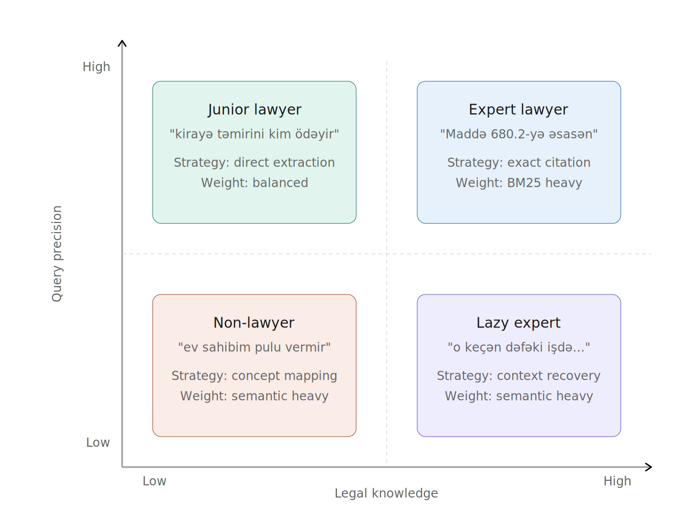
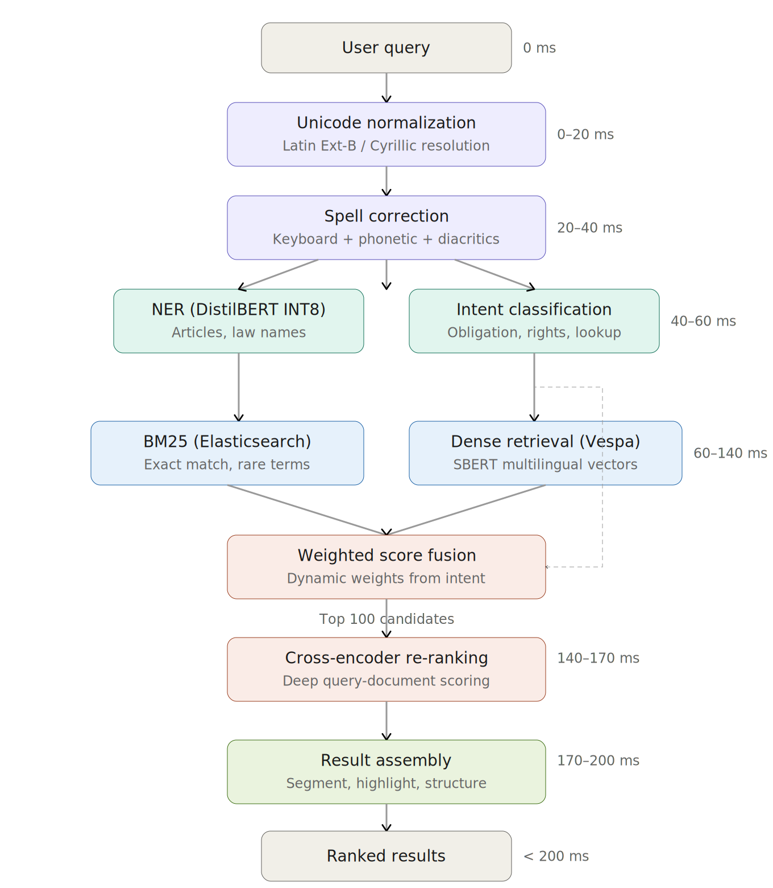
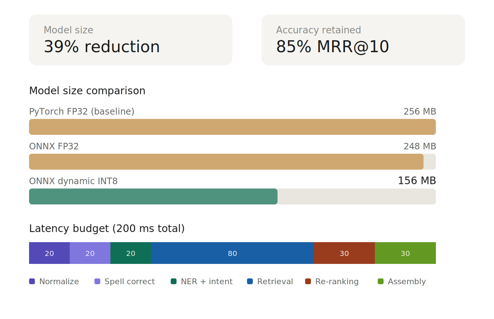
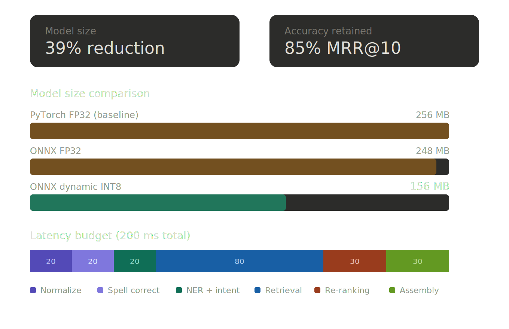

*Status: **Live in production** · 25,000 users · ~1,000 queries/day · NAIC*

## TL;DR

I built the ML search pipeline for Azerbaijan's national AI legal search platform at NAIC (National AI Center), part of the country's AI Strategy 2025–2028. The system serves 25k users and ~1k queries/day across 500k+ legal documents, returning ranked results in under 200ms end-to-end.

**Live:** [e-qanun.ai](https://e-qanun.ai) — **Research:** [research.e-qanun.ai](https://research.e-qanun.ai)

---

## Problem

Legal information retrieval in Azerbaijan was effectively broken. Citizens, lawyers, and judges all used the same keyword search over the national legal corpus — and it failed most of them, for different reasons.

A citizen types *"ev sahibim pulu vermir"* (my landlord won't pay) and gets nothing, because no statute contains those words. A junior lawyer searches *"kirayə təmirini kim ödəyir"* (who pays for rental repairs) and gets partial matches but misses cross-referenced articles. An expert searches *"Maddə 680.2-yə əsasən..."* and the system can't even match the query because of Unicode encoding inconsistencies in the Azerbaijani character *ə* (U+0259 Latin Extended-B vs. U+04D9 Cyrillic — visually identical, byte-level different).

The core challenge: build a retrieval system that works across all user types, handles a morphologically rich and under-resourced language, resolves encoding ambiguities, and returns legally correct results — fast enough that users don't abandon it.

---

## Architecture Overview

The pipeline has six stages, all executed within a 200ms latency budget:

**Stage 1 — Query Normalization (0–20ms)**
Unicode normalization to resolve Latin Extended-B / Cyrillic conflicts in Azerbaijani characters. Script detection and character-level canonicalization. This is not optional — without it, the same word encoded differently produces zero matches.

**Stage 2 — Spell Correction (20–40ms)**
Azerbaijani-specific error correction handling three error classes: keyboard proximity errors (QWERTY layout, e.g., *ə* → *a*), phonetic substitutions (*müqavilə* → *mugavile*, *məhkəmə* → *mehkeme*), and missing diacritics (*müqavilə* → *muqavile*). The correction pipeline applies edit distance, keyboard-neighbor lookup, phonetic matching, and morphological rule application in sequence.

**Stage 3 — Query Understanding (40–60ms)**
A quantized DistilBERT model handles two tasks in parallel:
- **NER**: Extracts article references (*Maddə 680*), law names (*Mülki Məcəllə*), and legal concepts from the query
- **Intent classification**: Categorizes the query type (obligation question, rights inquiry, procedural lookup, specific article retrieval) to adjust downstream retrieval weights

**Stage 4 — Hybrid Retrieval (60–140ms)**
Two retrieval paths run in parallel:
- **Lexical**: BM25 via Elasticsearch for exact-match and rare-term recall. Critical for article numbers, proper nouns, and legal terminology that dense models underweight.
- **Semantic**: Fine-tuned multilingual SBERT model serving dense vectors through Vespa. Vespa also runs its own BM25 for hybrid scoring internally.

Scores are combined via weighted linear combination. The weights are adjusted dynamically based on Stage 3's intent classification — article-reference queries shift weight toward BM25, conceptual queries toward dense retrieval.

**Stage 5 — Cross-Encoder Re-ranking (140–170ms)**
Top 100 candidates from Stage 4 are re-scored by a cross-encoder. Unlike the bi-encoder used in retrieval (which encodes query and document separately), the cross-encoder processes the query-document pair jointly, enabling deep token-level interaction scoring that catches relevance signals the first stage misses.

**Stage 6 — Result Assembly (170–200ms)**
Final ranking incorporates legal-hierarchy-aware signals: chapter → article → clause positioning, inter-article reference chains (e.g., Article 680.2 referencing Articles 681 and 699), and version history to surface the current-law version. Results are segmented and highlighted for the UI.

---

## Technical Decisions & Trade-offs

### Vespa + Elasticsearch instead of a single engine

I run BM25 in Elasticsearch and dense retrieval in Vespa, rather than consolidating into one system. Elasticsearch gives us battle-tested BM25 with mature Azerbaijani text analysis (custom analyzers, stemming). Vespa handles dense ANN search and also provides its own BM25 for internal hybrid scoring. The trade-off is operational complexity — two search clusters to maintain — but the alternative was worse: Elasticsearch's kNN was immature when we started, and running BM25 only in Vespa would have meant rewriting our existing text analysis pipeline.

### Weighted linear combination over RRF for score fusion

Reciprocal Rank Fusion is simpler and parameter-free, but it discards score magnitude. For legal search, magnitude matters: a BM25 exact match on "Maddə 680" should dominate over a semantically similar but wrong article. Weighted linear combination preserves this signal, and the weights adapt per-query based on intent classification. The trade-off is that it requires careful weight tuning and the intent classifier adds a failure mode — if classification is wrong, the fusion weights are wrong.

### Dynamic quantization over static for DistilBERT

I applied dynamic INT8 quantization via ONNX Runtime rather than static quantization with calibration data. Dynamic quantization gave us 39% model size reduction with minimal accuracy loss and no calibration data dependency. Static quantization could have pushed compression further, but it requires a representative calibration dataset — hard to define for legal queries that span casual language to precise article citations. The latency improvement from dynamic was sufficient to keep us within the 200ms budget.

### Cross-encoder on top 100, not top 20

Re-ranking 100 candidates instead of 20 is expensive, but legal search has a long-tail relevance problem: the correct article is often ranked 30th–80th by first-stage retrieval because the query uses colloquial language while the statute uses formal legal terminology. Cutting at top-20 would miss these. The trade-off is higher latency per query, but the accuracy gain justified it — users need the right article, not a fast wrong answer.

### Fine-tuned multilingual SBERT over training from scratch

Azerbaijani is low-resource (~10M speakers, limited NLP tooling). Training an embedding model from scratch would require a large parallel corpus we didn't have. Fine-tuning a multilingual SBERT model on our 500k+ legal document corpus gave us strong domain adaptation while leveraging cross-lingual transfer from Turkish (linguistically close) and English legal concepts. The trade-off: the base model's tokenizer isn't optimal for Azerbaijani morphology, which limits performance on highly agglutinative legal terms.

---

## Results

| Metric | Value |
|---|---|
| MRR@10 | 0.85 |
| NDCG@5 | 0.85 |
| End-to-end P95 latency | < 200ms |
| Model size reduction (ONNX INT8) | 39% |
| Corpus size | 500k+ legal documents |
| Daily query volume | ~1,000 queries/day |
| Active users | 25,000 |
| Re-ranking candidate pool | Top 100 |

User testing confirmed 85% accuracy across all four user categories: non-lawyers using colloquial language, junior lawyers with semi-structured queries, experienced lawyers with lazy/abbreviated queries, and experts citing specific articles.

---

## What I'd Do Differently

**Invest in evaluation infrastructure earlier.** We built the retrieval system before having a robust offline evaluation pipeline. This meant tuning fusion weights and re-ranking thresholds based on user testing sessions rather than automated metrics on a held-out test set. In retrospect, spending the first month building a proper evaluation harness with stratified test queries across all four user types would have accelerated every subsequent iteration.

**ColBERT-style late interaction instead of cross-encoder for re-ranking.** The cross-encoder produces the best relevance scores, but it's the latency bottleneck — scoring 100 pairs sequentially is inherently slow. ColBERT's precomputed token-level embeddings with MaxSim scoring would have given us most of the re-ranking quality at a fraction of the latency, and freed up millisecond budget for deeper structural analysis. This is the first thing I'd explore in a v2.

---

## Team & My Role

5–6 person AI team at NAIC. I owned the core ML subsystems: the retrieval pipeline (hybrid search, score fusion), model optimization (ONNX export, quantization), and the NER/intent classification components. System architecture decisions were collaborative, but I drove the technical choices documented above.

---

## Stack

`Python` · `PyTorch` · `ONNX Runtime` · `Elasticsearch` · `Vespa` · `FastAPI` · `DistilBERT` · `SBERT (multilingual)` · `Docker`

---

*Part of Azerbaijan's AI Strategy 2025–2028. Launched September 2025.*
*© 2026 NAIC — All rights reserved.*